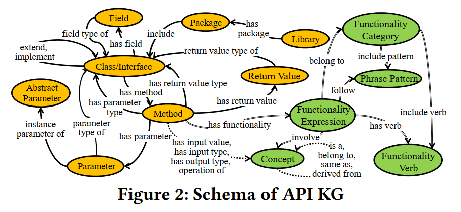

# kge4am.github.io
## Our project
The code of our project is divided into two parts, API KG construction and embedding and analogical API method inferring.
1. [APIKGConstructionAndEmbedding](https://github.com/kge4am/kge4am.github.io/blob/main/KGBuilder), the API KG construction code.
2. [AnalogicalAPIMethodInferring](https://github.com/kge4am/kge4am.github.io/blob/main/KG4APIMigration), the analogical API method inferring code.

[the excel file about the schema of API KG.](https://github.com/kge4am/kge4am.github.io/blob/main/KG4APIMigration/data/example/example.xlsx)

## Our data
### KGE4AM benchmark
This benchmark contains 245 pairs of analogical API methods from 16 pairs of analogical libraries, covering different topics such as JSON processing, testing, logging, and network requests. Either
one of a pair of analogical API methods can be used as the query API method and the other one as the ground truth, resulting in 245 × 2 = 490 query API methods.
1. [KGE4AMBenchmark](https://github.com/kge4am/kge4am.github.io/blob/main/KG4APIMigration/data/query_data/KGE4AMBenchmark.csv), the benchmark.
2. [KGE4AMBenchmarkRelateLibraries](https://github.com/kge4am/kge4am.github.io/blob/main/KG4APIMigration/data/query_data/KGE4AMBenchmarkRelatedLibraries.csv), libraries involved in the benchmark.

### KGE4AM KG and KGE4AM KG embedding
the version of our neo4j is v4.4.9.
1. [libraries.io](https://zenodo.org/record/3626071/files/libraries-1.6.0-2020-01-12.tar.gz), we first get the metadata (e.g., groupId and artifactId) of a list of Java libraries according to the Libraries.io dataset (last updated in January 2020).
2. [LargeKGE4AMKG](https://zenodo.org/record/7052635/files/big_kg_data.7z?download=1), we construct an API KG with 72,242,099 entities and 289,122,265 relations based on libraries.io, Among them, 59,155,631 entities are API elements, 5,210,925 entities are functionality elements, and 5,660,553 entities are concepts.
3. [LargeKGE4AMKGEmbedding](todo), we use LargeKGE4AMKG to train the KG embedding model based on ComplEx with a logistic loss.
4. [LargeKGE4AMKGRelatedLibraries](https://github.com/kge4am/kge4am.github.io/blob/main/KG4APIMigration/data/query_data/LargeKGE4AMKGRelatedLibraries.csv), libraries involved in the LargeKGE4AMKG.
5. [MediumKGE4AMKG](https://zenodo.org/record/7052230/files/middle_kg_data.7z?download=1), we construct an API KG with 2,292,021 entities and 2,172,115 relations based on libraries.io.
6. [SmallKGE4AMKG](https://zenodo.org/record/7052213/files/small_kg_data.7z?download=1), we construct an API KG with 35,013 entities and 8,192,215 relations based on libraries.io.
7. [SmallKGEmbedding](https://zenodo.org/record/7053015/files/small_kg_embedding.7z?download=1), we use SmallKGE4AMKG to train the KG embedding model based on ComplEx with a logistic loss.

## Evaluate result
### RQ1: Effectiveness with Given Target Libraries
Existing approaches for recommending analogical API methods only support the API mapping between two specific libraries. To compare with them more fairly, we also restrict KGE4AM to inferring analogical API methods with given target libraries. We compare KGE4AM with two document based baselines from previous work (i.e., RAPIM and D2APIMap) and a variant of KGE4AM (i.e., KGE4AM-Ret).
1. [RelatedLibraries](https://github.com/kge4am/kge4am.github.io/blob/main/KG4APIMigration/data/query_data/KGE4AMBenchmarkRelatedLibraries.csv), related libraires.
2. [KGE4AM-Ret](https://github.com/kge4am/kge4am.github.io/blob/main/KG4APIMigration/output/evaluate/big_apimigration_retrieve_filter.json), performance on KGE4AM-Ret with given target libraries.
3. [KGE4AM](https://github.com/kge4am/kge4am.github.io/blob/main/KG4APIMigration/output/evaluate/big_apimigration_rerank_filter.json), performance on KGE4AM with given target libraries.
4. [KGE4AMScript](https://github.com/kge4am/kge4am.github.io/blob/main/KG4APIMigration/script/temp_data_op/generate_temp_data_for_method.py), the script of KGE4AM with given target libraries.
5. [RAPIM](https://github.com/kge4am/kge4am.github.io/blob/main/KG4APIMigration/output/evaluate/big_rapim_filter.json), performance on RAPIM with given target libraries.
6. [RAPIMScript](https://github.com/kge4am/kge4am.github.io/blob/main/KG4APIMigration/script/rapim/generate_temp_data_for_rapim_method.py), the script of RAPIM with given target libraries.
7. [D2APIMap](https://github.com/kge4am/kge4am.github.io/blob/main/KG4APIMigration/output/evaluate/big_d2apimap_filter.json), performance on D2APIMap with given target libraries.
8. [D2APIMapScript](https://github.com/kge4am/kge4am.github.io/blob/main/KG4APIMigration/script/d2apimap/generate_temp_data_for_d2apimap_method.py), the script of D2APIMap with given target libraries.

### RQ2: Effectiveness without Given Target Libraries
We compare KGE4AM with baselines on inferring analogical API methods for randomly selected API methods without given target libraries. The baselines used in RQ1 (i.e., RAPIM and D2APIMap) do not support inferring analogical API methods without given target libraries. To this end, we first create a simple baseline by using BM25. We implement the BM25 baseline by using Elasticsearch. Then, we combine BM25 with RAPIM and D2APIMap respectively to create two baselines BM25+RAPIM and BM25+D2APIMap. They use BM25 to obtain the top-n 100 results as candidates and then re-rank candidate based on RAPIM or D2APIMap. We set n to be 100, which is the same as the retrieval step in KGE4AM.
1. [RelatedLibraries](https://github.com/kge4am/kge4am.github.io/blob/main/KG4APIMigration/data/query_data/KGE4AMSampleRelatedLibraries.csv), related libraires.
2. [KGE4AMSampleData](https://github.com/kge4am/kge4am.github.io/blob/main/KG4APIMigration/output/mark_result/big_sample_kge4am_method_10.json), sample data on KGE4AM without given target libraries.
3. [BM25SampleData](https://github.com/kge4am/kge4am.github.io/blob/main/KG4APIMigration/output/mark_result/big_sample_bm25_method_10.json), sample data on BM25 without given target libraries.
4. [BM25+RAPIMSampleData](https://github.com/kge4am/kge4am.github.io/blob/main/KG4APIMigration/output/mark_result/big_sample_rapim_method_10.json), sample data on BM25+RAPIM without given target libraries.
5. [BM25+D2APIMapSampleData](https://github.com/kge4am/kge4am.github.io/blob/main/KG4APIMigration/output/mark_result/big_sample_d2apimap_method_10.json), sample data on BM25+D2APIMap without given target libraries.
6. [SampleDataFinalMarkResult](https://github.com/kge4am/kge4am.github.io/blob/main/KG4APIMigration/output/mark_result/big_final_mark.csv), mark result between KGE4AM and baselines without given target libraries. 

### RQ3: Factor Impact
We conduct some experiments to explore the impact of some key factors on KGE4AM, i.e., KG embedding models, knowledge types, and similarity types and weights. To conduct various factor-related experiments more conveniently, we construct a small-scale API KG whose input is the all libraries involved in the benchmark of RQ1, i.e., 16 libraries.
1. [DiffKGEmbeddingModelsScript](https://github.com/kge4am/kge4am.github.io/blob/main/KG4APIMigration/script/temp_data_op/generate_single_parameter_temp_data_for_method.py), script of different KG embedding models.
2. [DiffKGEmbeddingModelsPerformance](https://github.com/kge4am/kge4am.github.io/blob/main/KG4APIMigration/output/evaluate/different_kg_embedding), performance on different KG embedding models.
3. [DiffKGEmbeddingModelsVectors](https://zenodo.org/record/7053035/files/different_kg_embedding.7z?download=1), vectors on different KG embedding models.
4. [DiffKnowledgeTypePerformance](https://github.com/kge4am/kge4am.github.io/blob/main/KG4APIMigration/output/evaluate/delete_one_rerank_parameter.json), performance on different knowledge types. 
5. [DiffKnowledgeTypeScript](https://github.com/kge4am/kge4am.github.io/blob/main/KG4APIMigration/script/generate_single_parameter_temp_data_for_method.py), script of different knowledge types. 
6. [DiffSimilarityContribution](https://gsithub.com/kge4am/kge4am.github.io/blob/main/KG4APIMigration/output/evaluate/delete_one_rerank_parameter.json), the contribution of different similarity in the rerank step.
